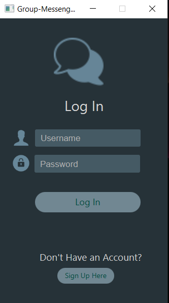
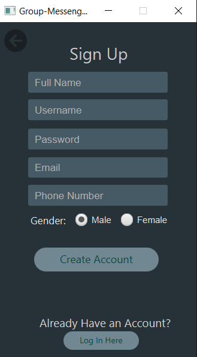
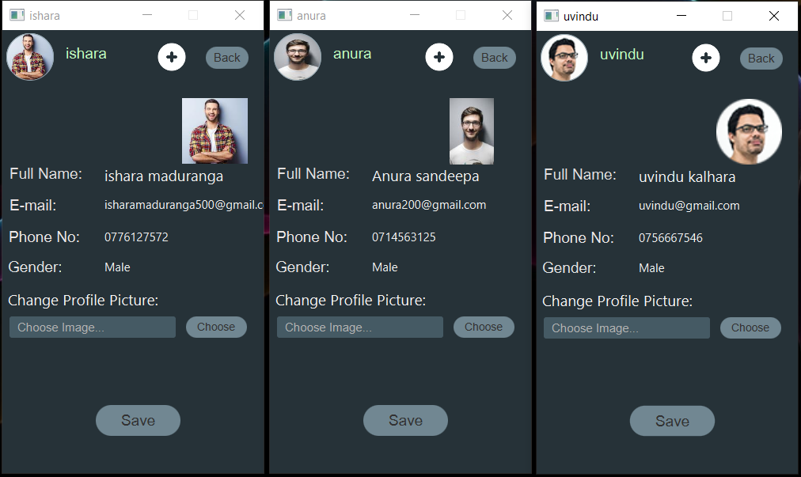
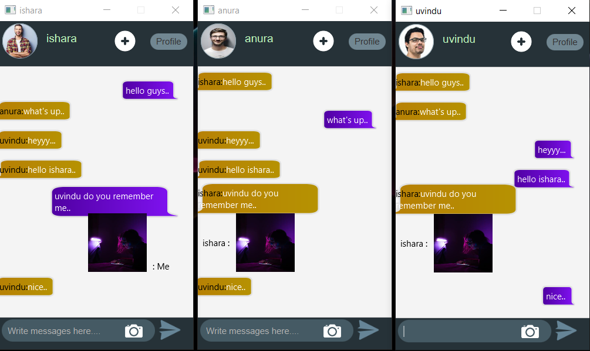

# Multi_Client_Chat_Application-Socket_Programming-in-Java

## Description
I just got started with socket programming so in order to improve my understandings of it I wanna build a multi-client chat application.

## Main Functions of Application
* Login Interface
* Create Account & signup Interface
* Manage Client Profile
* Chat room Interfaces

#### Also,This Application Optimized to Provide for Mobile Devices.

## :link: Basic Background of Application

### 🌱 Login Interface

### 🌱 Create Account & signup Interface

### 🌱 Manage Client Profile

### 🌱 Chat room Interfaces

## Technology/Framework used
* Socket Programming
* Java
* CSS
* JavaFx

## License
**Copyright @ 2022 All Right Reserved By Ishara Maduranga**